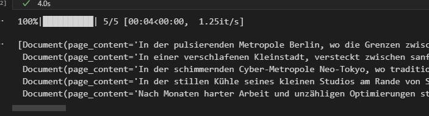
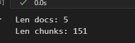
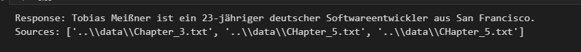

# RAGChatBot

## The RAGChatBot can answer questions about the contents based on the given data folder. To do this, it uses OpenAI, LangChain, RAG and Chroma.

### How to start 
Notebook: 
```
/Notebook/playground.ipynb
```
The data consists of short stories generated by ChatGPT. These can be exchanged if desired. Feel free :)

### Setup (sould working...):
```
pip install -r .\requirements.txt
```

### OpenAiApiKey
Save OpenAiApiKey in:
```
/Notebooks/.env
```
https://platform.openai.com/api-keys


### Result





